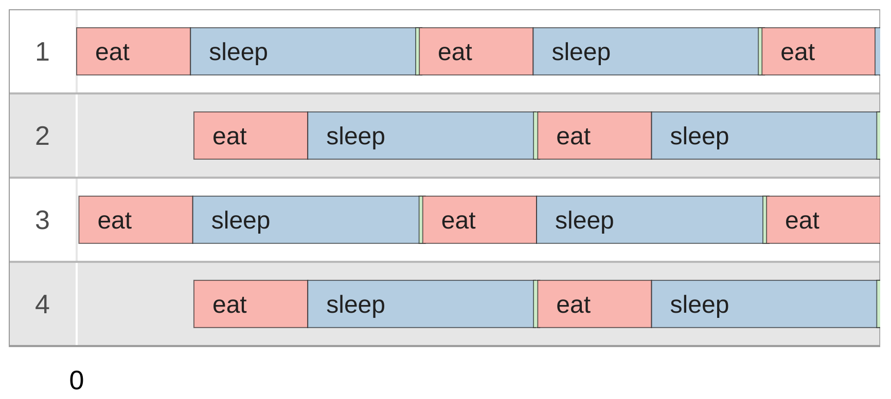

# Philosophers in Go

This project is my first attempt at using Go. It builds on what I learned from the [Tour of Go](https://go.dev/tour/welcome/1). Here, I solve the Dining Philosophers problem, which I previously [implemented in C](https://github.com/deniz-oezdemir/Philosophers), to explore Go's concurrency features.

## Table of Contents

- [Overview](#overview)
- [Key Learnings](#key-learnings)
- [Implementation Details](#implementation-details)
- [Installation and Usage](#installation-and-usage)
	- [Clone the Repository and Compile the Code](#clone-the-repository-and-compile-the-code)
	- [Run an Example](#run-an-example)
- [Sources](#sources)

## Overview

The [Dining Philosophers problem](https://en.wikipedia.org/wiki/Dining_philosophers_problem) is a classic synchronization problem involving philosophers who alternately eat, think, and sleep. Each philosopher needs two forks to eat, but there are only as many forks as there are philosophers, leading to potential deadlocks and starvation.


*Illustration by Benjamin D. Esham / Wikimedia Commons, [CC BY-SA 3.0](https://creativecommons.org/licenses/by-sa/3.0), [Link](https://commons.wikimedia.org/w/index.php?curid=56559)*

## Key Learnings

- **Concurrency**: Utilized goroutines and mutexes to manage concurrent execution and resource sharing among philosophers.
- **Time Management**: Implemented a custom `preciseSleep` function to improve the accuracy of sleep durations, although it still relies on `time.Sleep` and is less precise than the [C implementation](https://github.com/deniz-oezdemir/Philosophers/blob/main/utils.c).
- **Structs and Methods**: Used structs to represent philosophers and forks, and methods to define their behaviors.
- **Error Handling**: Demonstrated robust error handling and argument parsing in Go.

## Implementation Details

- **Configuration**: Command-line arguments are parsed into a `Config` struct, which holds the simulation parameters.
- **Philosopher Behavior**: Each philosopher is represented by a `Philo` struct and runs in its own goroutine, attempting to pick up forks, eat, sleep, and think.
- **Monitoring**: The main function monitors the state of the philosophers to detect when they have all eaten the required number of meals (if specified) or if any philosopher has died.

## Installation and Usage

To clone the repository, compile the code, and run an example, follow these steps:

### Clone the Repository and Compile the Code

```sh
git clone https://github.com/deniz-oezdemir/philo.git
cd philo
go build .
```

### Run an Example

Generally, the following input format can be used to customize the simulation parameters: `./philo <number_of_philosophers> <time_to_die> <time_to_eat> <time_to_sleep> [number_of_times_each_philosopher_must_eat]`

For example, the following command runs the simulation with 5 philosophers. They take 300 milliseconds to eat, 200 milliseconds to sleep, and think until forks become available. A philosopher will die if they don't eat within 800 milliseconds after they have started eating the last time.
```sh
./philo 5 800 300 200 3
```
The execution of the above example results in the following output with the format `<timestamp in milliseconds> <philosopher id> <action>`:
```
0 1 has taken a fork
0 1 has taken a fork
0 1 is eating
2 3 has taken a fork
2 3 has taken a fork
2 3 is eating
100 1 is sleeping
100 2 has taken a fork
102 3 is sleeping
102 4 has taken a fork
103 4 has taken a fork
103 4 is eating
102 2 has taken a fork
103 2 is eating
203 2 is sleeping
203 4 is sleeping
300 1 is thinking
301 1 has taken a fork
301 1 has taken a fork
301 1 is eating
303 3 is thinking
304 3 has taken a fork
304 3 has taken a fork
304 3 is eating
401 1 is sleeping
403 2 is thinking
403 4 is thinking
404 3 is sleeping
405 2 has taken a fork
405 2 has taken a fork
405 2 is eating
405 4 has taken a fork
405 4 has taken a fork
405 4 is eating
505 2 is sleeping
505 4 is sleeping
601 1 is thinking
602 1 has taken a fork
602 1 has taken a fork
602 1 is eating
605 3 is thinking
606 3 has taken a fork
606 3 has taken a fork
606 3 is eating
702 1 is sleeping
705 2 is thinking
705 4 is thinking
706 3 is sleeping
706 2 has taken a fork
706 2 has taken a fork
706 2 is eating
706 4 has taken a fork
706 4 has taken a fork
706 4 is eating
706 all philosophers have eaten 3 times
```

This output can be [visualized](https://nafuka11.github.io/philosophers-visualizer/) as below:



After each philosopher has eaten three times, the dinner ends and the program stops executing.

## Sources

- [Getting Started with Go](https://go.dev/doc/tutorial/getting-started#prerequisites)
- [Tour of Go](https://go.dev/tour/welcome/1)
- [Go Declaration Syntax](https://go.dev/blog/declaration-syntax)
- [Effective Go](https://go.dev/doc/effective_go)
- [My similar implementation in C](https://github.com/deniz-oezdemir/Philosopher)
